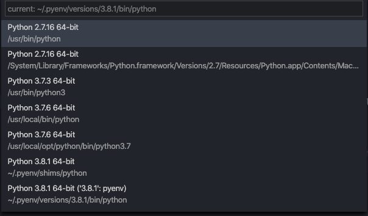
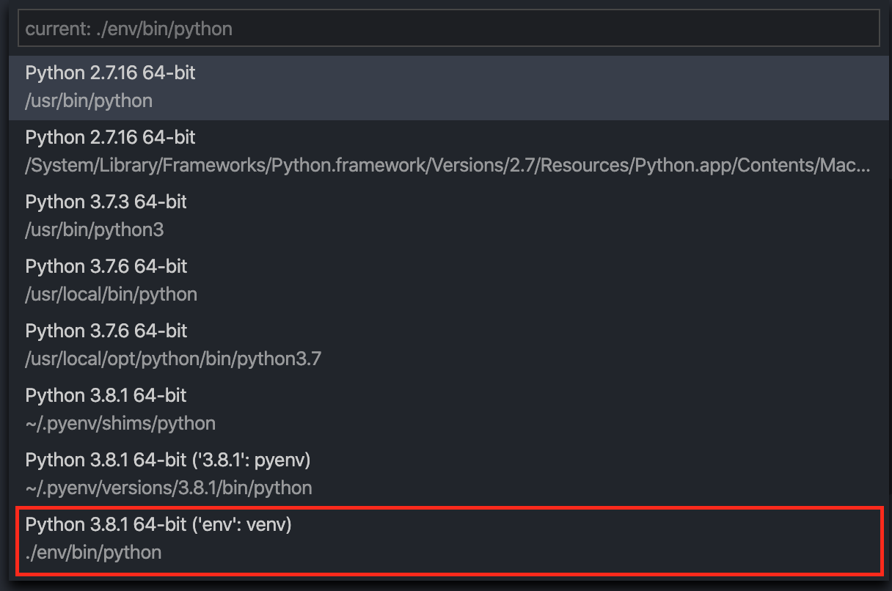

# 00004_venv

## setup venv

- `python -m venv env` creates a new venv in local dir
- `source env/bin/activate` starts the venv in current terminal
- `deactivate` to leave the venv
- `pip freeze > requirements.txt` to freeze deps
- [see more](https://packaging.python.org/guides/installing-using-pip-and-virtual-environments/)

> **info**
>
> vscode should be open with the project folder. If you take the parent project,
> it doesn't find the venv
>
> **parent folder** 
> **project folder** 
